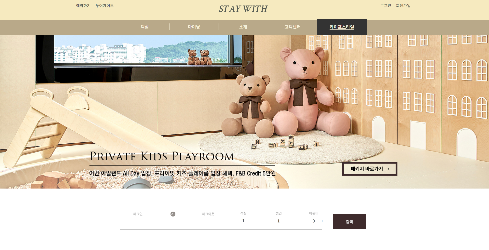
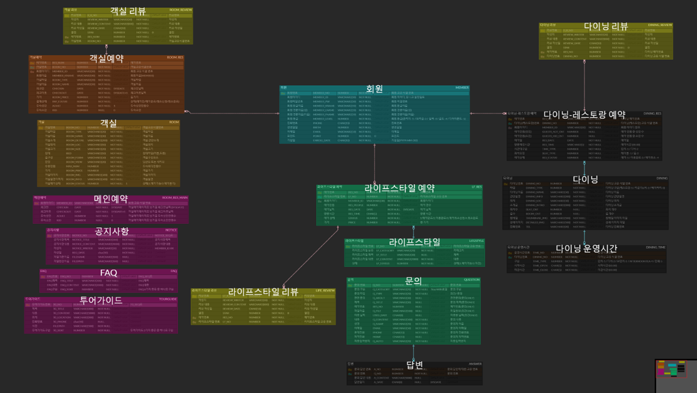
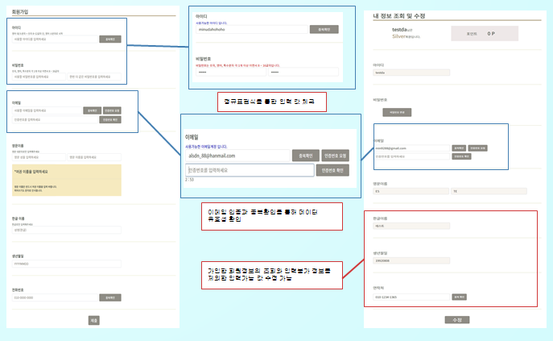
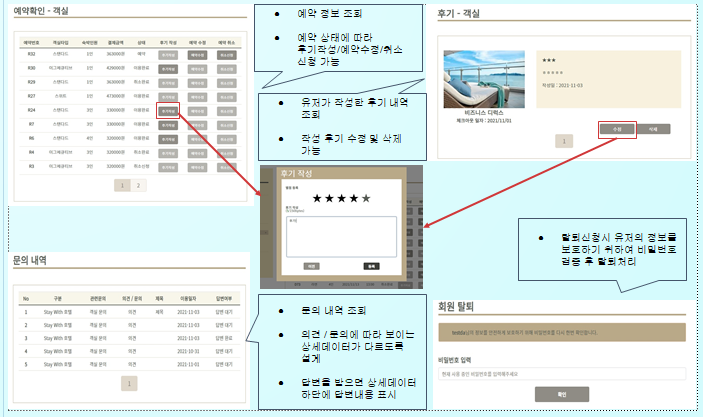
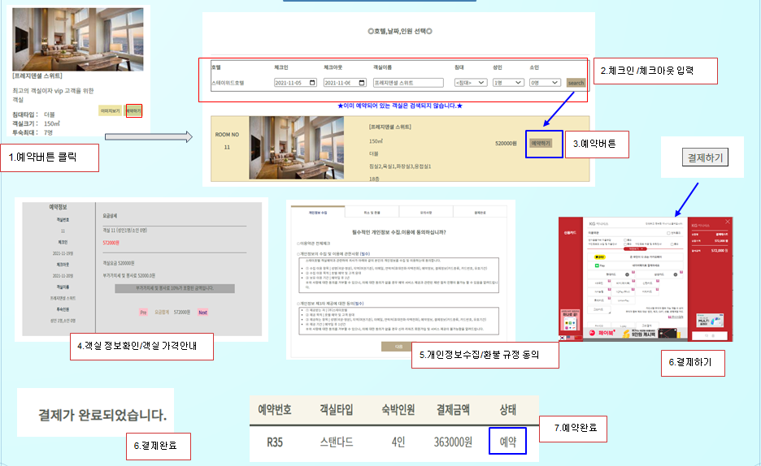
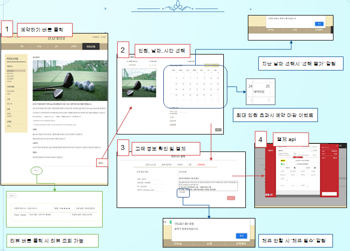
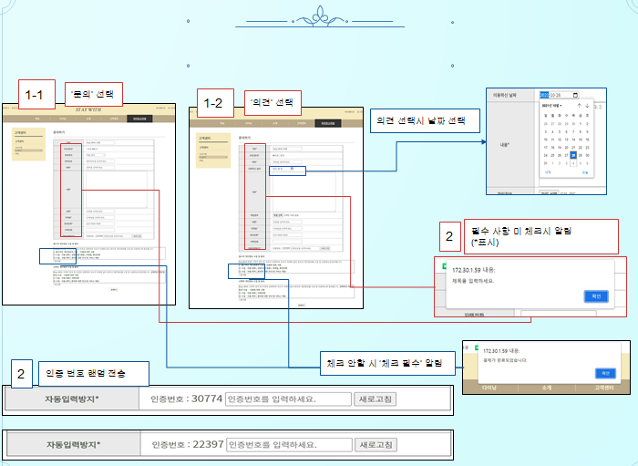

# StayWith

  
   <b>실시간 예약이 가능한 호텔 웹 사이트</b>
   
  

    

> 서비스명: StayWith       
> 개발기간: 2021.11.05 ~ 2021.11.23 (약 3주)   

## 팀원 역할   
| 이름   | 역할 | 내용                        |
| ------ | ---- | --------------------------- |
| 김주연 | 팀장 | 풀스택 개발, 라이프스타일 관리, 문의 등록, 멤버십, 피트니스 예약 관리 |
| 강세희 | 팀원 | 프론트 개발, 메인화면, 공지사항, 투어가이드, FAQ |
| 김효원 | 팀원 | 풀스택 개발, 객실 관리, 객실 예약 및 결제, 호텔 소개 |
| 원보현 | 팀원 | 풀스택 개발, 다이닝 예약 및 관리, 호텔 찾아오는 길(지도), 소메뉴 |
| 정기선 | 팀원 | 풀스택 개발, 관리자(예약, 전체 회원 관리, 고객 문의 관리) |
| 정민우 | 팀원 | 풀스택 개발, 로그인 및 회원가입, 마이페이지(계정정보,문의내역,리뷰관리,예약 관리) |

   
     

## 서비스 개요      
포스트 코로나, 위드 코로나 시대로 넘어가면서 사람들에게 위축되어 있던 여행 심리가 다시 열리고 있습니다. 이런 관점에서 앞으로 수요가 많을 호텔을 주제로, 호텔 룸 이외에도 다이닝, 피트니스 같은 다양한 서비스를 실시간으로 예약할 수 있는 호텔 예약 웹 사이트입니다.

   
     

### ✔ ER 다이어그램      

   
  

## 주요 기능

* **회원가입/로그인/내정보 관리 기능** 
> 

 

* **마이페이지 기능** 
> 

 

* **호텔예약 기능** 
> 

 

* **서비스예약 기능** 
> 

 

* **QnA 기능** 
> 

 
 
